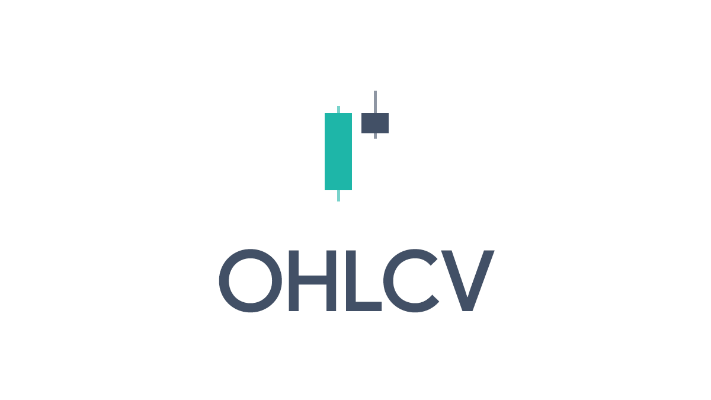

## Installation from source

To install `ohlcv` from source, locate and go in the **ohlcv** directory (same one where you found this file after cloning the git repository), execute:

```shell
$ pip install .
```

or for installing in [development mode](https://pip.pypa.io/en/latest/cli/pip_install/#install-editable):

```shell
$ pip install -e .
```

## Contribution guidelines

If you want to contribute to **OHLCV**, be sure to review the [contribution guidelines](CONTRIBUTING.md). By participating, you are expected to uphold this guidelines.
